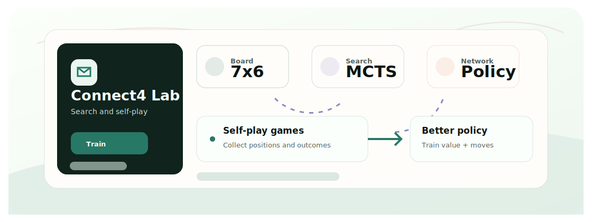

<div align="center">
  <h1>NeuralConnect4</h1>
  <p>A Connect Four AI experiment combining neural networks, MCTS, and self-play training.</p>

  <p>
    <a href="README.zh-CN.md">Chinese</a>
    &middot;
    <a href="#quickstart">Quickstart</a>
    &middot;
    <a href="#tech-stack">Tech Stack</a>
  </p>

  <p>
    
    
    
  </p>
</div>

<p align="center">
  
</p>

## Why This Exists

Connect Four is small enough to experiment quickly, but rich enough to study search, policy/value networks, and self-play loops inspired by AlphaZero-style learning.

## Quickstart

```bash
git clone https://github.com/Ha22yX/NeuralConnect4.git
cd NeuralConnect4
python -m venv .venv
.venv\Scripts\activate
pip install -r requirements.txt
python game/main.py

cd game/ai_training
python train_neural.py --num_iterations 5 --num_simulations 100
```

The GUI starts a local Connect Four board. Training settings can be increased after a smoke test.

## Features

- Pygame Connect Four interface for local play.
- ResNet-style policy/value network experiments.
- Neural-guided MCTS and self-play training loop.
- Training logs and visualization hooks for iteration review.

## Tech Stack

| Layer | Technology | Role |
| --- | --- | --- |
| Game | Pygame | Board UI and local play loop. |
| Learning | PyTorch | Policy/value neural network. |
| Search | MCTS | Move selection guided by network evaluation. |
| Analysis | matplotlib, TensorBoard | Training progress inspection. |


## Project Notes

This is a learning and experimentation repo, not a polished game product. Human-vs-AI inference is a natural next step after checkpoint loading is finalized.
